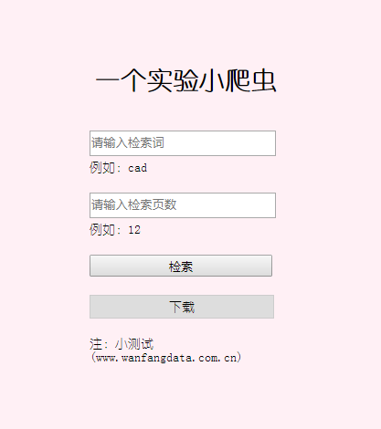
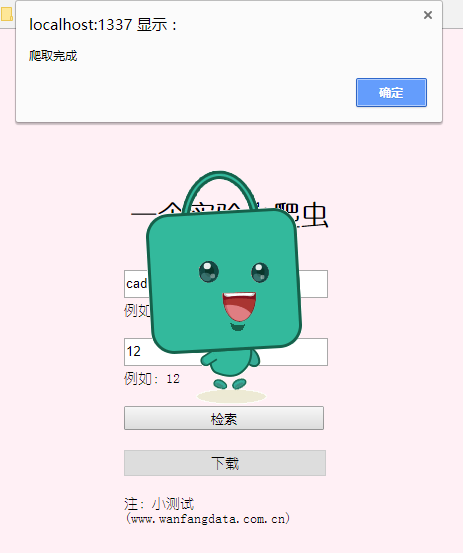
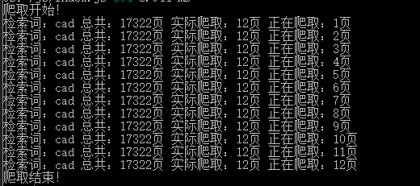
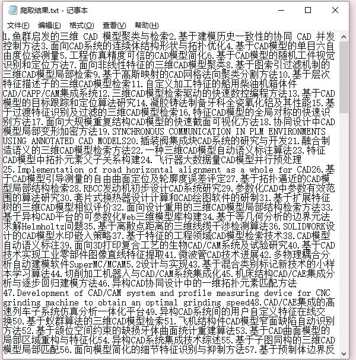
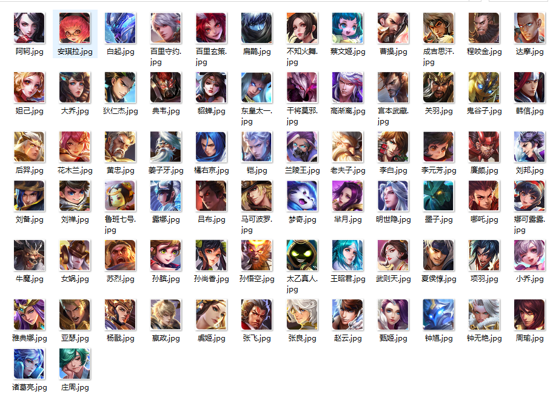

## 一、爬虫小实验（文章标题 || 王者荣耀头像）
### 1、本地运行
* git clone 项目地址
* cd node-spider || node-stream
* npm install
* node app.js || index.js

### 2、技术
1. cheerio
2. node( http.get(options[, callback]) )
3. stream 

### 3、UI
> 文章标题
 
* 页面UI

*  爬取数据

*  日志

*  数据下载

> 王者荣耀头像

## 二、nodemailer

> 邮件发送

### 1、本地运行
* git clone 项目地址
* cd node-email 
* npm install
* node app.js

